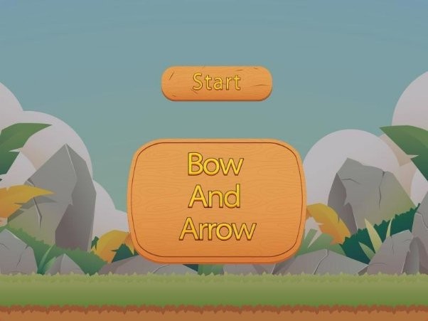
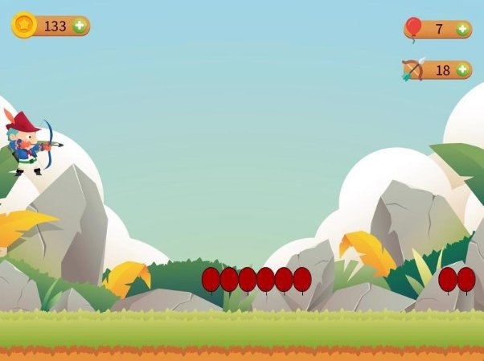
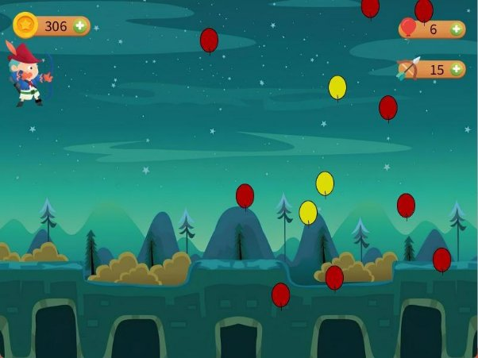
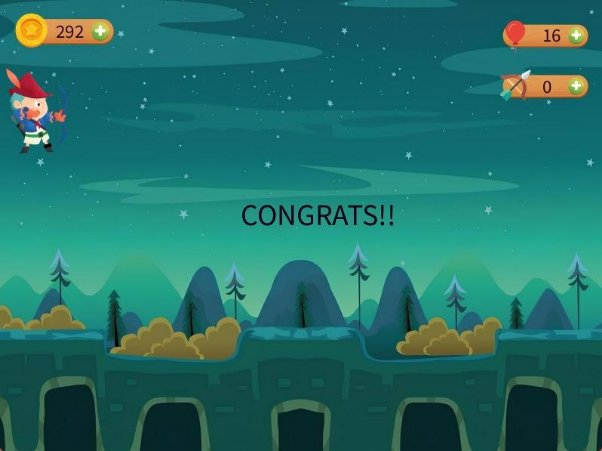
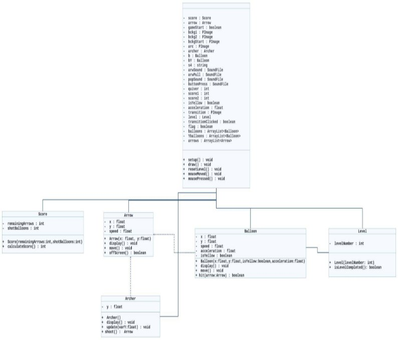

**Cairo University      Faculty of engineering SBE Department**

Task 1

Bow and Arrow game

|Name|Code|
| - | - |
|ﻣﺻطﻔﻰ أﺷرف ﻣﺻطﻔﻰ ﻋﺑداﻟرﺣﯾم|9230875|
|زﯾﺎد أﺷرف أﺣﻣد ﻣﺣﻣد|9230391|
|ﻣﺣﻣد ﺣﻣدي ﻋﺑداﻟﺣﻣﯾد|9240038|
|ﻋﻣرو ﻣﺣﻣود ﻋﺑداﻟﻔﺗﺎح|9230639|

Abstract/introduction: The task was mainly about designing a game close to (bow & arrow 1992 game). The game’s target was about aiming at as much balloons as possible ro hit with the arrow. the design of the game required our team to have basic knowledge of Processing, OOP principles and java syntax. The process of developing and testing the code multiple times was fun and beneficial as it added a lot to our organizing skills.

Methods: The process of designing the code for this game mainly went through three stages. First, we needed the basic general knowledge about processing to be able to understand the mechanism of the application and how to deal with it.

After establishing basic knowledge about processing, the next stage was about finding the exact ways of implementing each and every future we wanted to add in the code. This stage needed researching about the syntax and implementation for each future.

Finally, comes the stage of testing the code and adding extra futures. The code then was ready to run efficiently.

Role of Each Member:

1. ZEYAD ASHRAF
   1. Writing most of the code and tested it.
   1. Dealt with errors.
   1. Debugging.
1. MOSTAFA ASHRAF
   1. Writing the documentation
   1. Helped in solving the errors.
   1. Debugging.
1. AMR MAHMOUD
   1. Doing the UML DIAGRAMS.
   1. Recoding the video test.
1. MOHAMED HAMDY
- Writing the documentation.
- Get the pictures and sound of the game.

Some problems & bugs during coding and were fixed:

- In level two, the score was starting from zero and not accumulated as ordered, so I used a variable to store the value of the previous level score to reuse it in the next level.
- In level two, the red balloons were overlapping on each other. This was because we randomized the x positions which caused this, Actually Y positions only that should be randomized.
- Using two separate Arraylist classes was the best which is one for red and another for yellow, so that I can check winning case in level two.

Game strategy: The game mainly has two levels. At the first level the player has to hit 15 red aligned balloons having only 20 arrows in his quiver. The player has to hit all the balloons in order to move to the next level. If the player used all of his arrows and still didn’t hit all the balloons, he can Right click to rest the level from the beginning. After hitting all the balloons in level 1, the player will move to the next level where he should hit all the red random balloons to win. There are also 3 yellow balloons with random acceleration to make it harder for the player to focus on hit red targeted balloons. As in level 1,If the player used all of his arrows and still didn’t hit all the balloons, he can Right click to rest level 2.

Deeper look inside the game:

1. Opening screen: first thing to appear when you launch the game. It has a start button that starts the game when you press it.

2. level (1): starts with 15 red aligned balloons. The player has to hit them all using the 20 arrows in his quiver. If the player used all of his 20 arrows before hitting all the balloons, he can right click to restart the level.
3. Transition screen: appears in between the two levels. You press the “Level 2?” button to move to the next level.

4. level (2): The player has to hit all the random red balloons with the yellow ones as a bonus. Also if the player used all of his 20 arrows before hitting all the balloons, he can right click to restart the level.

5. End screen: Appears at the end of the game. The final score also appears at the left top of the screen.

UML Diagram

References

- <https://processing.org/reference/>
- [Introduction - Processing Tutorial](https://youtube.com/playlist?list=PLRqwX-V7Uu6ZYJC7L-r6rX6utt6wwJCyi&si=9_MDtZzHAGdYbE_V)
- [Creative Coding for Beginners - Full Course!](https://youtu.be/4JzDttgdILQ?si=Ui5ZWYUG4sYeItaG)
- [Game Emulator](https://classicreload.com/win3x-bow-and-arrow.html)
- [Bow and Arrow (Windows game 1992)](https://www.youtube.com/watch?v=cY6wWYDqF8Y)
- [adobe stock](https://stock.adobe.com)
8
